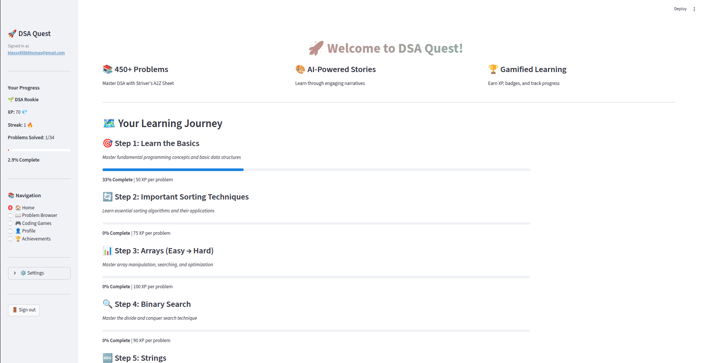
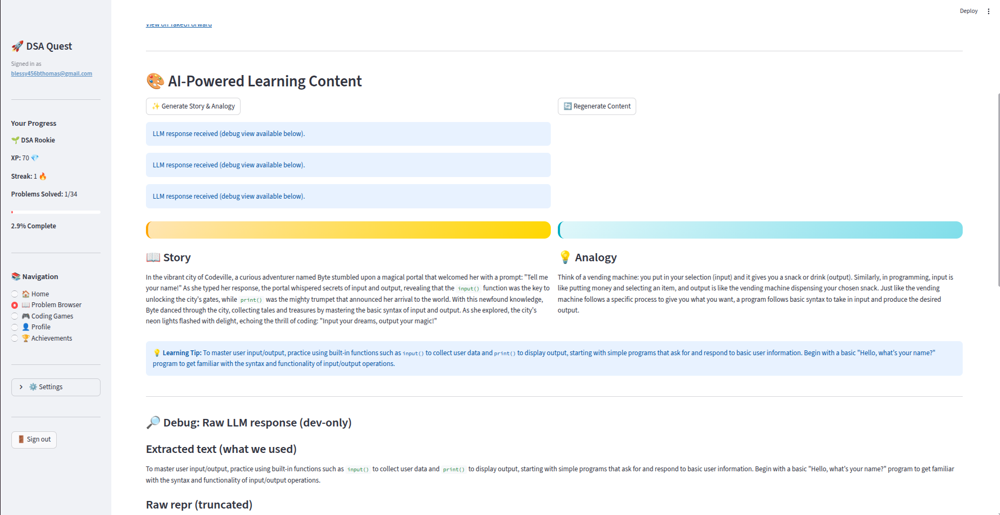
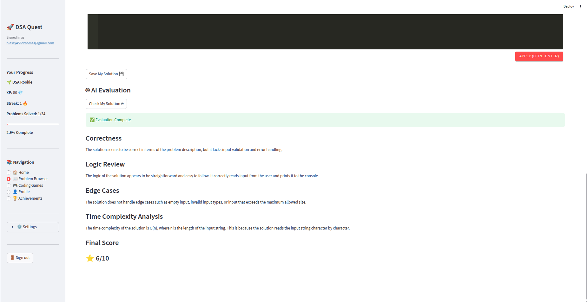
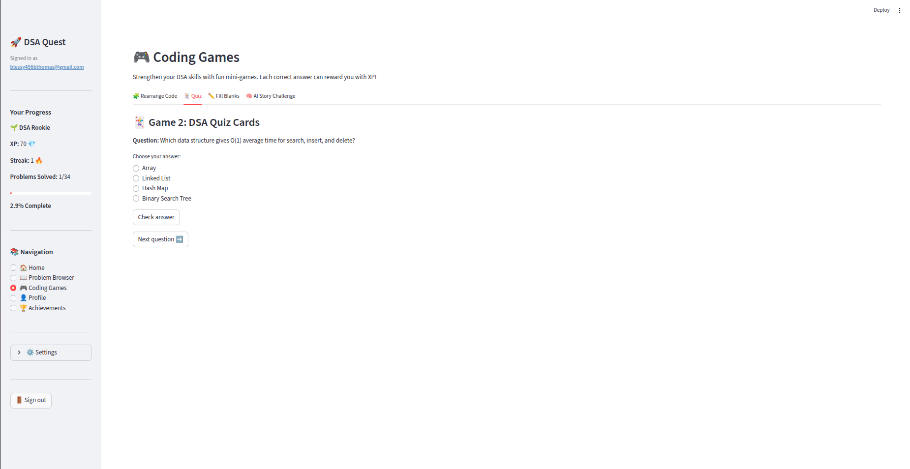
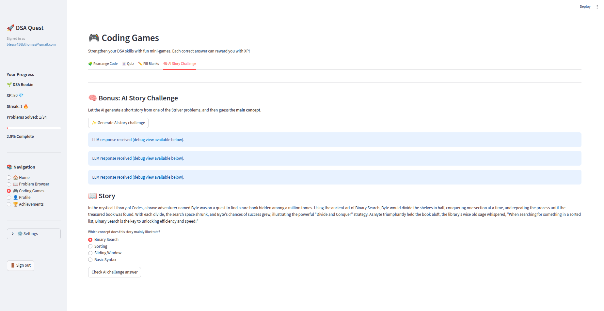
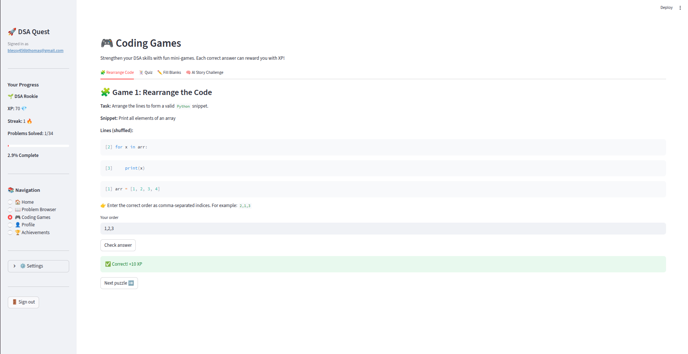
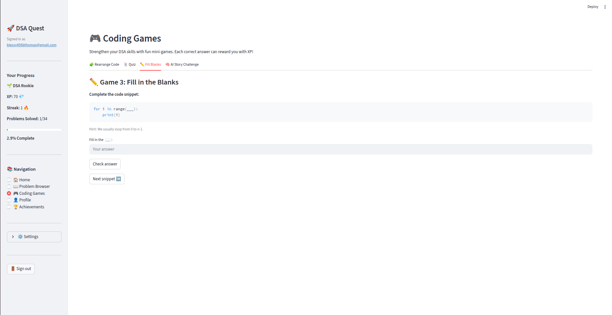
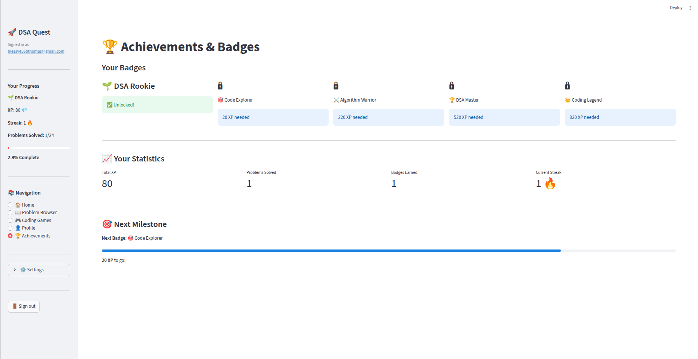
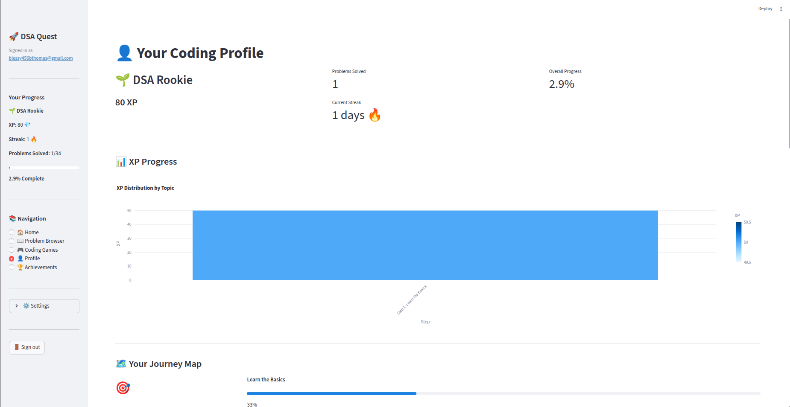
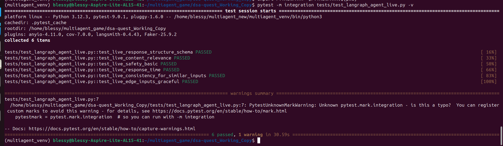

# Abstract
**DSA Quest** is a  multi-agent learning platform designed to transform how developers prepare for Data Structures & Algorithms. What began as a prototype — a collaborative LLM-based reasoning workflow — has evolved into a resilient, secure, test-driven system with a full user interface, authenticated user isolation, safety guardrails, multi-agent reasoning, gamified learning, and real-time AI evaluation.

At its core, the system blends gamification, LLM-powered storytelling, and structured problem-solving to increase retention, engagement, and conceptual understanding. The result is a polished agentic application engineered to be used by real learners, not just as a demonstration.
### Home Page



### Problem Browser


# 🎮 Introduction

Mastering  **Data Structures and Algorithms (DSA)** remains one of the most essential skills for software engineers, competitive programmers, and technical interview candidates. DSA determines how efficiently we solve problems, design systems, and think computationally — yet traditional learning methods are often boring, theory-heavy, and difficult to stay consistent with.

### **DSA Quest was built to solve this!**

It transforms the rigorous world of DSA into an **engaging, gamified, AI-powered learning experience — supported by a production-grade multi-agent system, real-time LLM reasoning, safe evaluation, and multi-user isolation using Supabase authentication.**

It started with a simple question:

*What if DSA could be learned the same way players progress through a game — with stories, analogies, XP, levels, achievements, and instant feedback?*

Instead of passive reading, learners experience:
- 🎮 Interactive DSA mini-games
- 🔍 Problem browser covering problems from Striver’s A2Z Sheet
- ✨ AI-generated Story Mode & Analogies
- ✍️ Practice Area with AI solution evaluator
- 🧠 Personalized learning content generated via LangGraph agents
- 🏆 XP, badges, progress tracking, and streaks
- 🔒 Individual user sandboxes thanks to Supabase authentication
- 🛡️ Safety guardrails and a complete testing suite

# 🧠 Motivation

**Gamification** is not decoration — it is cognitive engineering.

Research consistently shows:

- stories improve long-term recall
- analogies enable conceptual reframing
- micro-rewards (XP, badges) improve motivation
- immediate feedback accelerates skill acquisition

DSA Quest integrates these principles into a single learning environment.

Our motivations were:
- Make hard concepts feel approachable via narratives and analogies generated by a structured LLM agent.
- Maintain engagement over long study periods through XP, streaks, badges, and level progression.
- Provide safe, instant code evaluation without server execution by using an LLM evaluator agent with guardrails.
- Offer a real production-grade experience including secure authentication, multi-user isolation, and resilient workflows.

This project demonstrates how agentic AI systems can move beyond prototypes into fully productionized systems — with safety, testing, resilience, and real usability at their core.

# System Architecture
The system is built on three cooperating layers:

### A. Application Layer (Streamlit UI)
### B. Multi-Agent AI Layer
### C. Backend Layer (Supabase)

The architecture of the DSA Quest application is designed to support scalable multi-user access, real-time interactivity, safe LLM-generated content, and an integrated learning experience that blends problem-solving, gamification, and AI-assisted guidance. Each layer of the system is built to operate independently while working cohesively to ensure reliability and production-grade performance.

At the foundation of the platform is a Streamlit-based user interface, which manages rendering, session separation, and real-time state updates. This UI layer interacts with a set of well-structured backend modules responsible for user authentication, progress tracking, problem browsing, AI-generated educational content, and interactive coding games. 


The learning experience itself is driven by two key AI components. The first is a story and analogy generator, which uses Groq-powered Llama models via LangGraph. This module produces concept-focused, error-filtered explanations and learning narratives optimized for clarity. The second is the LLM-based code evaluator, a standalone evaluator that safely analyzes the logic of user-submitted solutions in any language without executing the code. It uses strictly defined prompts, guards, sanitization routines, and controlled sampling settings to ensure both safety and determinism.
Two AI Subsystems Inside :
### 1. Story + Analogy Generator (LangGraph Orchestrated)

Used in the Problem Browser:
✔ Generates engaging stories
✔ Generates analogies
✔ Generates specific learning tips
✔ Groq-powered Llama supports near-instant responses
✔ Debug-traceable
✔ Fallback templates ensure reliability


### 2. LLM Code Evaluation System (Static Review, No Execution)

Used in the Practice Area:
✔ Safe — never runs user code
✔ Works with Python, Java, C++ or pseudocode
✔ Deep comments on logic, structure, clarity
✔ Suggests fixes and improvement. Sandboxed prompts and deterministic temperature settings
 

A Supabase instance serves as the authentication and persistence backbone, ensuring that every user operates in an isolated environment where their data — solved problems, XP history, game progress, and generated content — remains strictly scoped to their account.


Each page of the app — the Problem Browser, Coding Games suite, Profile dashboard, Achievements hub, and Practice Area — is powered by clear, modular components to keep the system maintainable and testable. Every unit of logic is self-contained, enabling targeted testing and predictable behavior under failure. Together, these design principles allow DSA Quest to function as a cohesive, production-ready learning platform that remains extensible for future features.
# Model Selection Rationale
The decision to build the system using **Groq and LangGraph** was guided by clear engineering requirements. Groq provides exceptionally low-latency inference with stable throughput under load, allowing the system to offer interactive AI features — such as instant story generation and code evaluation — without latency spikes. The deterministic performance profile reduces timeout complexity and strengthens the system’s resilience strategy.

LangGraph was chosen because it allows structured multi-step reasoning in a controlled graph environment. Unlike one-off LLM calls, LangGraph enables composition of workflows where output quality can be validated at each node. This is essential for producing structured story/analogy output and ensuring that malformed AI responses are detected early. Its ability to define strict schemas, fallback nodes, and execution guards makes it ideal for production systems where reliability and predictability take priority.

Together, Groq and LangGraph form a stable and efficient AI pipeline that keeps the platform responsive, safe, and easy to maintain — meeting the exact requirements of the  production readiness.
# Gamified Learning Experience

The four integrated mini-games serve as short-form reinforcement tools that help users internalize concepts in a low-pressure environment. Each game targets a different cognitive dimension: speed recognition, conceptual pairing, memory retention, and logic sequencing. These games do not replace problem-solving but support it by strengthening the user’s familiarity with terminology, patterns, and common DSA structures. All gameplay events are locally contained and do not interfere with the core problem-solving workflow, but they contribute to XP to ensure motivational continuity across the application.
### Game 1: Quiz 

### Game 2: AI based story game quiz

### Game 3 : Rearrange

### Game 4 : Filll in the blanks

Beyond games, the platform extends gamification into the problem-solving workflow itself. Users accumulate XP as they progress through Striver’s A-Z curriculum, unlocking badges that reflect not just quantity but category-specific mastery. The streak system encourages consistent engagement while the Profile and Achievements pages provide clear visibility into long-term progression. Together, these elements convert the traditionally solitary experience of learning DSA into a structured, rewarding journey without compromising academic rigor.
#### Achievements and Badges

#### Streaks

# AI-Assisted Learning Modules
To support deeper understanding, the platform integrates two distinct AI systems, each responsible for a different pedagogical objective. The first, responsible for generating stories, analogies, and learning tips, operates through a LangGraph-managed workflow executed on Groq’s ultra-low-latency inference models. This setup allows every generated explanation to pass through a structured chain that extracts concepts, creates narrative framing, simplifies technical ideas, and validates factual correctness before returning the final output to the user. This multi-step design ensures the generated content is not only engaging but also technically accurate. 
These generate content in **3 popular programming languages : Python, Java, C++** available as radio buttons in UI.


The second AI system is embedded in the Practice Area as a logic evaluator. Unlike traditional “run code” environments, this evaluator does not execute user-submitted code. Instead, it performs a reasoning-based assessment of correctness, time complexity, missing edge cases, and algorithm design soundness. The evaluation output is structured, safe, and deterministic, fully independent of language-specific environments. It allows users practicing C++, Java, or Python to receive feedback on their logic without any of the risks associated with arbitrary code execution. This design aligns with production safety requirements and maintains the integrity of the platform.

Together, these AI components transform static problem-solving into a guided learning process where explanations, reasoning feedback, and conceptual clarity support the user at every stage of progression.
# Security, Guardrails, and Safety Controls

Behind the interactive interface, the system enforces multiple layers of safety to ensure reliability and responsible AI usage. All user inputs — including arbitrary code typed into the Practice Area — undergo strict preprocessing routines. These routines scan for high-risk patterns such as file operations, subprocess calls, uncontrolled loops, and dynamic evaluation primitives. Inputs that violate these constraints are rejected with clear feedback before reaching the AI evaluator.

On the AI output side, every model response passes through validation filters and structured parsing to eliminate malformed content, hallucinations, or inconsistencies. The LangGraph workflow includes checkpoints that reject outputs lacking required sections or violating formatting rules. Groq models were selected specifically for their deterministic latency and predictable behavior at scale, which helps reduce timeout risks and simplify failure handling.
Guardrails were added and tested for safety, full app testing and these were modified from producing harmful content to harmless content.
### Before Safety Tests

### After Safety Tests


Operational safety is reinforced through retry mechanisms, controlled sampling configurations, timeout caps, and error-aware fallbacks. Every LLM call and external tool interaction is internally wrapped with logging hooks that capture exceptions, delays, and validation failures for later inspection. Even in cases where AI components fail, the platform maintains stable behavior by returning meaningful error messages instead of letting the system degrade unpredictably.

This layered safety design ensures that the system remains robust, transparent, and secure throughout heavy use.

# Quality Assurance and Testing Strategy

The production version of DSA Quest is backed by a comprehensive testing suite that covers unit modules, integrated workflows, and full end-to-end flows. Core logic — such as progress tracking, authentication handling, step progression, and badge assignment — is validated through unit tests that simulate typical user interactions. These tests ensure that all counters, completion flags, boundary cases, and XP calculations behave deterministically.
### Unit Testing


### Integration Testing and Full Coverage App Test 



Integration tests focus on interactions between the UI layer and backend modules. They verify that navigation states persist correctly across sessions, that authenticated and unauthenticated access paths behave as expected, and that AI modules return properly structured output when invoked. Additional tests simulate LLM failures, timeouts, missing fields, and malformed responses to verify the stability of fallbacks and retries.

End-to-end tests were added to validate complete user journeys: signing in, browsing problems, solving them, saving solutions, using games, and viewing progress pages. These workflows ensure that the system operates consistently across isolated sessions and that Supabase maintains data integrity across multiple users.
# Steps to setup
### 🧩 1. Clone the Repository
```bash
git clone https://github.com/Blessy456b/dsa-quest.git
cd dsa-quest
```
The entire app lives inside a clean, modular folder structure:

dsa-quest/  
│── app.py                   # Streamlit UI + Multi-Agent Orchestration  
│── langraph_agent.py        # Story/Analogy workflow powered by LangGraph  
│── llm_evaluator.py         # AI-powered code reviewer  
│── dsa_data.py              # Striver sheet + problem metadata  
│── games.py                   # All 4 gamified learning modes  
│── progress_tracker.py      # Multi-user XP, streaks, badge logic  
│── backend_user.py          # Supabase auth & user persistence  
│── requirements.txt  
│── README.md    
├── test_dsa_data.py  
├── test_guardrails.py  
├── tests    
│   ├── test_backend_user1.py  
│   ├── test_backend_user.py  
│   ├── test_langraph_agent_live.py  
│   ├── test_langraph_agent.py  
│   ├── test_langraph_agent_semantic.py  
│   ├── test_progress_tracker.py  
│   └── test_retry_utils.py  
├── tests_safety  
│   ├── test_harmful_inputs.py  
│   ├── test_prompt_injection.py  
│   └── test_refusal_cases.py  
├── user_data  
│   └── user_data_default_user.json  
└── utils  
    ├── guardrails.py  
    ├── healthcheck.py  
    ├── logging_config.py  
    └── retry_utils.py  

###  🧩 2. Create Virtual Environment (Recommended)
```bash
python3 -m venv venv
source venv/bin/activate        # macOS / Linux
```
###  🧩 3. Install Requirements
```bash
pip install -r requirements.txt
```
This installs:
- Streamlit UI 
- LangGraph
- Groq LLM Client
- Supabase Auth
- Plotly
- streamlit-ace (coding editor)
- streamlit-lottie (animations)

###  🧩 4. Configure Environment Variables

Create a .env file at project root:
```bash
touch .env
```
example:

- SUPABASE_URL=your_supabase_url
- SUPABASE_KEY=your_supabase_service_key
- GROQ_API_KEY=your_groq_key_here

###  🔑 Where to get your keys?

- Groq Key → https://console.groq.com

- Supabase Project URL & Anon Key → Supabase Dashboard → Project Settings → API

Enable Email Auth under Supabase Authentication → Providers

###  🧩 5. Set Supabase Redirect URLs (Important)

Inside Supabase Authentication → URL Configuration:

- Site URL (local testing):
http://localhost:8501

- Redirect URLs:
http://localhost:8501
https://<your-streamlit-cloud-app>.streamlit.app

### 🧩 6. Run the App Locally
```bash
streamlit run app.py
```
Your app opens automatically at:
#### http://localhost:8501

You now have:

- ✔️ Multi-user login
- ✔️ Email-based signup & verification
- ✔️ Gamified learning dashboard
- ✔️ Story & Analogy generation via LangGraph
- ✔️ AI code evaluator
- ✔️ 4 interactive DSA games
- ✔️ Progress tracking + badges + XP

## 🚀 Deployment Guide (Streamlit Cloud)

This app is 100% compatible with Streamlit Cloud.

### 1. Push repo to GitHub
```bash
git add .
git commit -m "initial release"
git push origin main
```

### 2. Go to Streamlit Cloud
```bash
https://share.streamlit.io
```
Click Deploy app → Choose Repo.

### 3. Add Secrets

Paste your full .env content into Streamlit Secrets:
```bash
SUPABASE_URL=...
SUPABASE_KEY=...
GROQ_API_KEY=...
```
### 4. Deploy 🚀

Your app becomes publicly accessible at:
```bash
https://<appname>.streamlit.app
```

### 🧪 Running Tests (Module 3 Requirement)

We include:
- Unit tests
- Integration tests
- End-to-end agent loop tests
- Safety guardrail tests
- Code evaluator tests

To run:
```bash
pytest -vv
```

Coverage:
```bash
pytest --cov=.
```
### 🛡️ Safety & Guardrails

Now app ships with:

- ✔ Prompt Injection Defense
- ✔ Output filtering
- ✔ Harmful pattern detection for code evaluator
- ✔ Loop limits for agents
- ✔ Timeout protection
- ✔ Invalid input sanitization
- ✔ Error boundary fallback model
- ✔ Per-user session isolation
# 🏗️ Technology Stack
### 🔹 Frontend
- Streamlit – interactive UI, reactive components, full multi-page architecture
- streamlit-ace – in-browser coding editor with syntax highlighting
- Plotly – dynamic XP and progress visualizations
- streamlit-lottie – lightweight animations for gamified UX
### 🔹 Backend / Agents
- LangGraph – deterministic multi-agent orchestration for story + analogy workflows
- Groq LPU (LLaMA-3 70B Turbo & 8B) – ultra-fast, low-latency inference for all AI operations
- Custom LLM Evaluator – safe, isolated logic-only evaluation of user code
### 🔹 Database & Auth
- Supabase – user authentication, email verification, per-user progress storage
- Row-Level Security – isolation of user XP, streaks, and completed-problem logs
### 🔹 Safety & Testing
- Python + PyTest – unit, integration, E2E agent tests
- Custom Guardrail Layer – input validation + content filtering
- Retry handlers, loop caps, and timeouts – ensures agent stability

# 🚀 Conclusion

DSA Quest transforms traditional DSA learning into a gamified, AI-augmented, story-driven experience designed for real learners—not just for demonstration. Unlike static problem sheets or passive tutorials, DSA Quest brings together:
- Narrative-based pedagogy (story + analogy generation)
- Fully interactive problem solving (editor + LLM evaluator)
- Four cognitive-reinforcement games
- Personalized progress system (XP, streaks, badges)
- Multi-agent reasoning built on LangGraph
- Fast, safe, production-grade AI inference using Groq

This project demonstrates not only multi-agent AI techniques, but also the real-world engineering  for Module 3 of the AAIDC—security, testing, UX, and operational resilience.

DSA Quest is now a deployable, scalable, user-friendly learning platform that proves your ability to architect, harden, and ship real AI systems.

# 🔭 Future Work
Several enhancements can elevate DSA Quest into a full learning ecosystem:
- 🔹 1. Real Code Execution Sandbox
A safe, containerized execution engine (e.g., CodeRunner, Piston API, Docker-sandbox).
Would allow running user code securely (currently logic-only review).
- 🔹 2. Leaderboards & Community
-- Global leaderboard
-- Weekly streak challenges
- 🔹 3. Adaptive Learning Curriculum
-- AI estimates each learner’s mastery
-- Dynamically adjusts difficulty
-- Personalized problem recommendations
-🔹 4. More Advanced Agents
-- Explanation agent
-- Code optimizer agent
-- Testcase generator agent
- 🔹 5. Expanded Content
The architecture already supports these expansions without restructuring by adding more content to data.json.

# 📚 References

- LangGraph Documentation
https://langchain-ai.github.io/langgraph/
- Groq LPU Inference Platform
https://console.groq.com
- Supabase Authentication & Database
https://supabase.com/docs
- Streamlit Framework
https://docs.streamlit.io/
- Striver’s A2Z DSA Sheet (Problem Source)
https://takeuforward.org/interviews/strivers-sde-sheet-top-coding-interview-problems/
- OpenAI Safety Guidelines (Prompt Injection Concepts)
https://platform.openai.com/docs
- Plotly Visualization Library
https://plotly.com/python/

# 🔑 Licensing and Usage Rights
This project is released under the MIT License, which allows:

- Free use, modification, and distribution
- Commercial and non-commercial usage
- Inclusion in open-source or proprietary systems
- Users must simply retain the original copyright and license notice.

# 🧩 Acknowledgements
Developed by Blessy Thomas
Built with curiosity using Streamlit, LangGraph, and Supabase technologies for Ready Tensor certification.

# ✨ Contact
For queries
github : 
https://github.com/Blessy456b

gmail : 
blessy456bthomas@gmail.com
